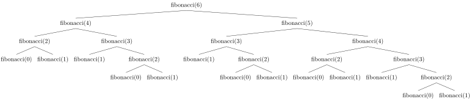

# Rekursion in Python

Rekursion ist eine fortgeschrittene Programmiertechnik. Weil Python 
mächtige und flexible Schleifenkonstruktionen zur Verfügung stellt,
werden in Python rekursive Lösungen vor allem verwendet, um über
Strukturen mit unvorhersehbaren Formen und Tiefen zu
iterieren. Daher ist die Rekursion eine
nützliche Technik, die man kennen muss.

Weil rekursiv implementierte Funktionen eine fortgeschrittenere Lösung
für Probleme darstellen, und vor allem für anspruchsvollere Aufgaben ein
nützliches Hilfsmittel sind, lohnt es sich, Fehlvorstellungen im
Zusammenhang mit der rekursiven Implementierung von Funktionen
aufzudecken und richtig zu stellen. 

## Was heist *Rekursion*?

Rekursion bedeutet auf sich selber Bezug zu nehmen. Im Programmieren ist
dies dann der Fall, wenn eine Funktion sich selber aufruft.

## Was charakterisiert eine rekursive Funktion?

Gegeben ist das folgende Beispiel:

```python
def shining():
    
    print("All work and no play"
          "makes Jack a dull boy.")
    
    shining()
```

Was geschieht, wenn die Funktion aufgerufen wird?

Es wird grundsätzlich

```txt
All work and no play makes Jack a dull boy.
```

endlos ausgegeben.  
Damit Rekursion zielführend eingesetzt werden kann, braucht es eine
Abbruchbedinung.

Wie muss das Beispiel angepasst werden, damit die Funktion nach fünf
ausgaben stoppt?

```python
def shining_u(stop=0):
    if stop >= 5:
        return
    print("All work and no play"
          "makes Jack a dull boy.")
    stop += 1
    shining_u(stop)
```

## Wie kommt man zu einer rekursiven Funktion?

Ausgangslage bietet der kleine Gauss:

$$
1+2+3+4+\dots+n = \sum_{k=1}^{n} k = \frac{n(n+1)}{2}=\frac{n^2+n}{2}
$$

Kann diese Aufgabenstellung auch rekursiv definiert werden?

$$
\sum_{k=1}^{n}k=
\left\{
    \begin{array}{lll}
        1,&n=1&\text{Basisfall}\\
        n+\sum\limits_{k=1}^{n-1}k,&\forall n > 1&\text{Rekursionsfall}
    \end{array}
\right.
$$

Dies bietet die Möglichkeit, ein grosses Problem solange in kleinere
Probleme zu zerlegen, bis ein lösbares Problem übrig bleibt.

## Rekursion sichtbar machen

Wie muss die Funktion gauss() angepasst werden, damit die Rekursion
sichtbar gemacht werden kann?

```txt
gauss(5)
    gauss(4)
        gauss(3)
            gauss(2)
                gauss(1)
                return 1
            return 2 + 1
        return 3 + 3
    return 4 + 6
return 5 + 10
```

## Anwendungsbeispiel $n!$

Kann $n!$ rekursiv formuliert werden?

$$
n!=
\left\{
    \begin{array}{lll}
    1,&n = 0 \lor n = 1&Basisfall\\
    n \cdot (n-1)! & \forall n > 1 &Rekursionsfall\\
    \end{array}
\right.
$$

## Rekursion ist nicht alternativlos

Rekursive Funktionen können auch iterativ geschrieben werden.  
Wie sieht der kleine Gauss als schleife aus?

```python
def gauss_loop(n):
    total = 0
    while n >= 1:
        total += n
        n -= 1
    return total
```

## Beurteilung von rekursiven Lösungen

- Funktionen sind oft einfach zu schreiben
- die inneren Abläufe der Funktionen sind schwerer nachzuvollziehen
- braucht viel Speicherplatz

## Darstellung der Stärken und Schwächen am Beispiel der Fibonacci Zahlen

Die Fibonacci Zahlen können rekursiv folgendermassen dargestellt werden:

$$
f(n)=
\left\{
    \begin{array}{ll}
    0,& n=0\\
    1,& n=1\\
    f(n-1)+f(n-2),&\forall n > 1\\
    
    \end{array}
\right.
$$

aber

